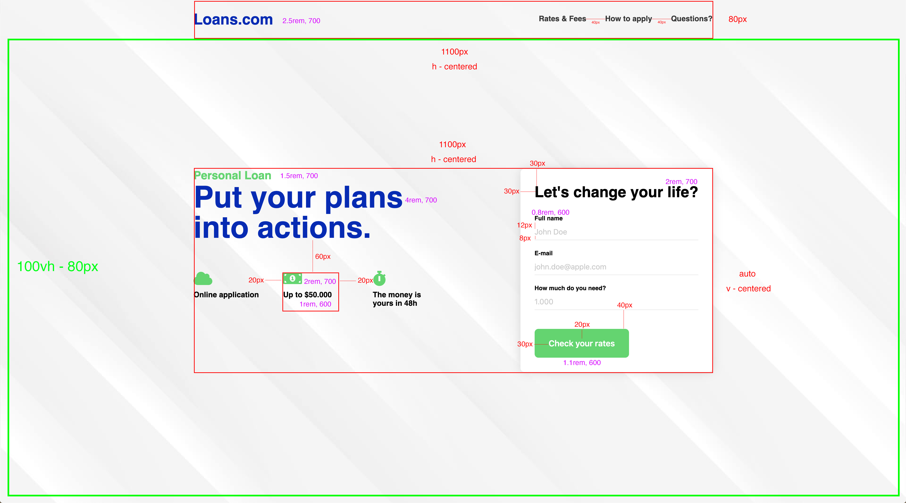

# Important information

Read the following guidelines before doing the exercises.

## How do you begin?

1. [*Fork*](https://guides.github.com/activities/forking/) the repository containing exercises.
2. Clone the repository onto your computer using the command: `git clone repository_address`.
   You will find the address of the repository by pressing "Clone or download" button on its webpage.
3. Complete the exercises and commit changes to your repository using the commands below.
   `git add filename` will add a single file which you have changed.
   If you want to add all the changed files at once, use `git add .`.
   Remember that the fullstop (dot) at the end of this command is important!
   Next, commit changes using `git commit -m "description_of_changes"`.
4. Push changes to your repository on GitHub by typing: `git push origin master`.
5. Create a [*pull request*](https://help.github.com/articles/creating-a-pull-request) to the original repository when you have finished all the exercises.

### Do the exercises in appropriate files.

**The repository with the exercises will be removed 2 weeks after the end of the course. This will result in the removal of all forks made from this repository.**


Your task is to create a landing page about loans. The page consists of two sections:
- logotype with navigation (`.header`)
- the main part (`.main`) divided into:
  - description (`.intro__info`)
  - form (`.intro__form`)

The whole page should fit in 100% of the browser height.  

#### Logotype with navigation
Create an HTML structure for this part. In the file `index.html` there is a place to put the HTML code for the whole header. Follow these guidelines:

- logotype should be a link,
- navigation list should be created using `nav`, `ul`, `li`, and `a`. Each of its elements should be clickable.  

#### Main part
The main part should be centered vertically and horizontally relative to the whole window.  

#### Icons in the main section
These are "Font Awesome" icons. The `head` of the page should include appropriate styles responsible for this font:
```html
<link rel="stylesheet" href="https://cdnjs.cloudflare.com/ajax/libs/font-awesome/5.9.0/css/all.min.css"/>
```
These icons should be added to `.icons__item` classes using **pseudo-elements**. **Do not add any additional classes or IDs to these elements in order to add icons!** Use other methods that you know.

Pseudo-elements must have the `font-weight` set to `bold`, `font-family` to `"Font Awesome 5 Free"` and `content` respectively to:
- `"\f0c2"`
- `"\f3d1"`
- `"\f2f2"`

#### General guidelines
Look at the picture below as well, you will find it easier to understand the commands. Try to recreate this template according to the guidelines:

* `reset` or `normalize` must be attached to the project
* the font used is Montserrat (add it with Google Fonts) in the following variants: 400, 600, 700
* colors used in the project (use CSS3 variables):
```css
:root {
  --main-color: rgb(1, 36, 186);
  --accent-color: rgb(9, 216, 98);
  --text-color: rgb(53, 53, 53);
}
```
* the rounding (if any) is `8px`
* the background is in the folder `images/background.jpg`
  - should be centered, non-repeating, matching the `body`
* use the `container` class to limit the width and center the content
* section `.intro__form` has a shadow with  blur of `20px` and color `rgba(0, 0, 0, .13)`

#### Layout with plan - `images/layout-plan.jpg`

- red lines indicate distances between the elements or their sizes
- purple texts refer to the size and thickness of the font


### Sources
- Layout: https://dribbble.com/shots/5982586-Personal-Loan-Landing-page-concept by [Renato Stefani Filgueiras](https://dribbble.com/renatosf)
- Background: [Background vector created by starline - www.freepik.com](https://www.freepik.com/free-photos-vectors/background)
